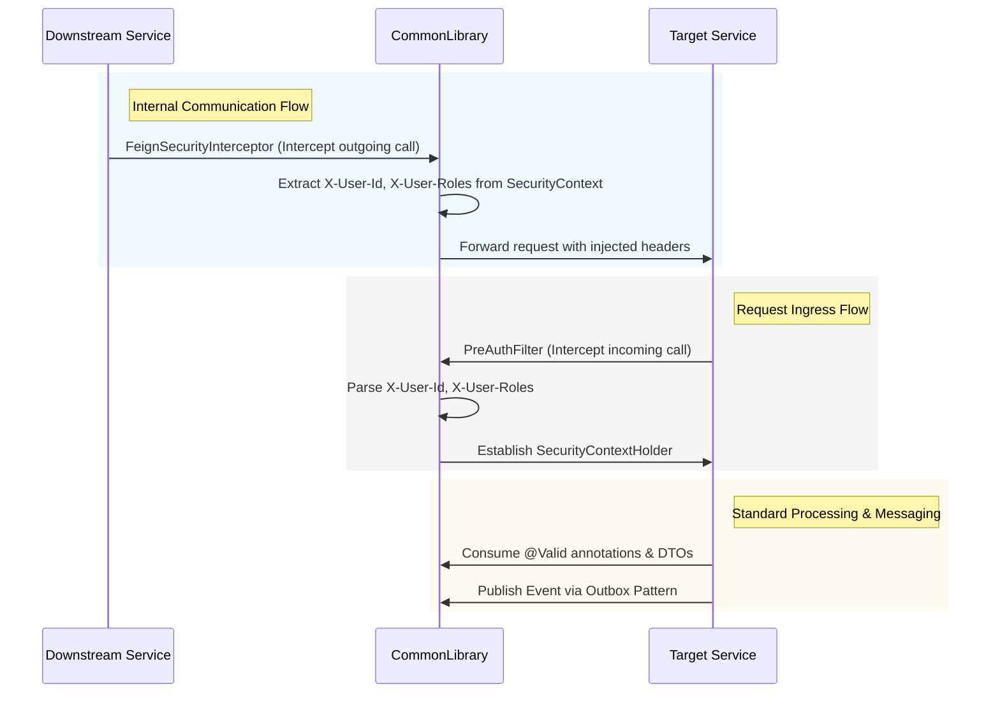

# CommonLibrary Architecture

The `CommonLibrary` provides shared DTOs, configurations, enums, security filters, and events that are utilized across the Food Delivery microservices ecosystem. It ensures code reusability and standardizes communication models between services (e.g., via Kafka and Feign).

## Detailed Sequence Diagram

Since `CommonLibrary` is not a standalone service but a shared dependency, the flow diagram illustrates how it integrates into the request lifecycle of a typical microservice.

